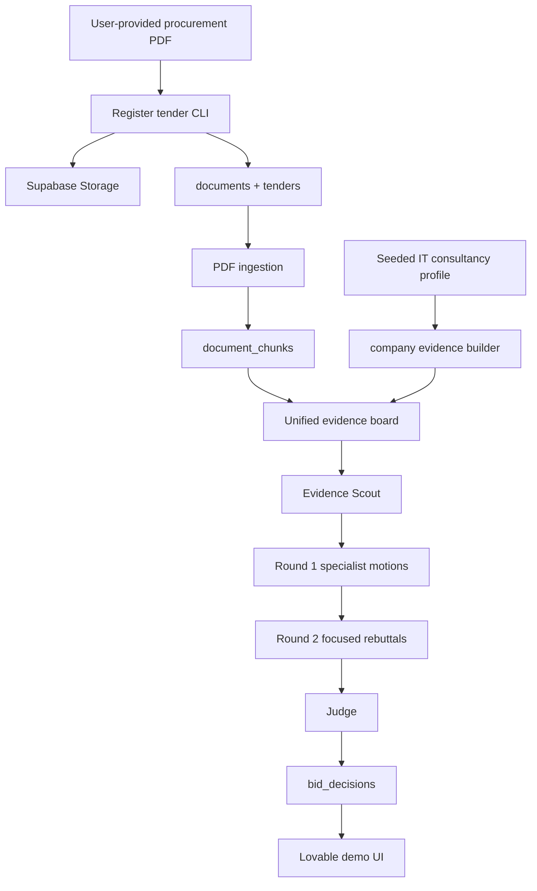

# Bidded

Bidded är en hackathon-scopad agentkärna för bid/no-bid-beslut i offentlig upphandling. Målet är att kunna mata in en textbaserad PDF för en svensk upphandling, jämföra kraven mot en seedad profil för ett större IT-konsultbolag, bygga en gemensam evidensyta och sedan låta flera specialiserade agenter argumentera fram ett spårbart beslut: `bid`, `no_bid` eller `conditional_bid`.

Projektet är byggt kring en enkel princip: inga materiella påståenden utan evidens. Allt som agenterna hävdar ska kunna knytas till excerpt-nivå `evidence_items`. Det som saknar stöd ska markeras som antagande, saknad information, valideringsfel eller potentiell blockerare, inte smyga in som fakta.

## Nuvarande Status

Det här repot är just nu i PRD- och storyfasen. Den faktiska Python-applikationen är ännu inte scaffoldad i root-repot.

| Del | Status |
| --- | --- |
| `ralph/prd.json` | Komplett PRD med 15 user stories för Bidded Swarm Core. Alla stories har `passes: false`. |
| `ralph/state.json` | Pekar på `US-001`, "Scaffold Python agent core", som nästa implementation. |
| `plans/ralph-storie-plan.md` | Sammanfattar PRD:n, datakontraktet, swarm-flödet och testplanen. |
| `Makefile` | Kör Ralph-loop med Claude CLI via `make ralph`. |
| `.env.example` | Innehåller idag endast `ANTHROPIC_API_KEY` för lokal Ralph/Claude-körning. |
| Applikationskod | Inte skapad än. PRD:n anger att paketet ska ligga under `src/bidded`. |
| Supabase-migrations | Inte skapade än. De kommer i `US-002`. |
| Frontend | Ingen frontend i repot. Lovable är planerad som tunn demo-UI ovanpå Supabase senare. |

README:n beskriver därför både nuläget och den stack som PRD:n definierar att vi bygger mot. När stories implementeras ska den här filen uppdateras så att planerade delar flyttas till faktiskt levererade delar.

## Vad Systemet Ska Göra

Bidded ska stödja ett konkret demo-flöde:

1. En operator registrerar en lokal, textbaserad PDF för en svensk offentlig upphandling.
2. PDF:en laddas upp till Supabase Storage och registreras som ett dokument.
3. Dokumentet parsas till sidrefererade chunks.
4. En seedad demo-profil för ett större IT-konsultbolag läggs in i databasen.
5. Tenderchunks och bolagsfakta omvandlas till excerpt-nivå evidence items.
6. En Evidence Scout extraherar upphandlingens viktigaste fakta.
7. Fyra specialistagenter gör oberoende Round 1-motions.
8. Samma agenter gör fokuserade Round 2-rebuttals.
9. En Judge-agent sammanfattar röster, blockerare, risker, saknad information och rekommenderade actions.
10. Slutbeslutet sparas i Supabase som ett auditerbart `bid_decision`.

Input och output är engelska enligt PRD:n, men beslutskontexten är svensk offentlig upphandling.

## Stack

### Planerad Runtime-Stack

| Område | Teknik | Roll |
| --- | --- | --- |
| Språk | Python | Huvudruntime för agentkärna, CLI, ingestion, schemas och orchestration. |
| Agent-orchestration | LangGraph | Kör Evidence Scout, specialistmotions, rebuttals och Judge i ett kontrollerat flöde. |
| LLM | Claude via Anthropic API | Producerar strukturerade agentoutputs. Miljövariabeln är `ANTHROPIC_API_KEY`. |
| Databas | Supabase Postgres | Source of truth för bolag, upphandlingar, dokument, chunks, evidens, agentkörningar och beslut. |
| Filstorage | Supabase Storage | Lagrar upphandlings-PDF:er och kopplar dem till dokumentrader. |
| Datamodell | SQL migrations + JSONB | Normaliserade tabeller där relationer är stabila, JSONB där agent- och domändata är mer flexibel. |
| Validering | Pydantic | Strikta schemas för agentroller, verdicts, evidence refs, blockerare, rebuttals och Judge-beslut. |
| PDF-processing | Text-PDF extraction | Endast textbaserade PDF:er är i scope. OCR och DOCX är uttryckligen non-goals för PRD:n. |
| Retrieval | Keyword/full-text fallback + optional embeddings | Demo ska fungera utan live embeddings men vara redo för embedding/pgvector senare. |
| Test | pytest | Deterministiska tester med mockad Claude, mockade embeddings och mockad Supabase där det behövs. |
| Lint | Ruff | Kvalitetsgrind för Python-koden. |
| UI | Lovable ovanpå Supabase | Planerad tunn demo-UI som skapar/läser runs men inte äger agentlogik. |

### Stack Som Finns I Repot Idag

| Område | Teknik | Status |
| --- | --- | --- |
| PRD/story-runner | Ralph | Aktivt. `ralph/prd.json`, `ralph/state.json`, `ralph/progress.md` och `ralph/ralph.sh` styr arbetet. |
| Lokal automation | Make | `make ralph` kör Ralph med Claude CLI. |
| LLM för implementation | Claude CLI | Makefile sätter `RALPH_CLAUDE_CMD="claude --bare --model ... --print"`. |
| Miljö | `.env` via Makefile include | `.env.example` dokumenterar bara `ANTHROPIC_API_KEY` idag. |
| App-runtime | Python/LangGraph/Supabase | Planerad men inte implementerad än. |

## Arkitektur



Den viktigaste arkitekturregeln är att agenter inte ska resonera fritt från lösa promptar. De ska arbeta mot en gemensam evidence board och validerade schemas.

## Datakontrakt

PRD:n definierar följande Supabase-tabeller:

| Tabell | Syfte |
| --- | --- |
| `companies` | Demo-bolaget, i första versionen ett större IT-konsultbolag med kapacitet, certifieringar, referenser och ekonomiska antaganden. |
| `tenders` | Upphandlingar som analyseras mot bolagsprofilen. |
| `documents` | Registrerade dokument med storage path, checksum, content type, roll, parse-status och koppling till tender/company. |
| `document_chunks` | Sidrefererade textchunks från PDF:er, med chunk index, metadata och nullable embedding/vector-placeholder. |
| `evidence_items` | Excerpt-nivå evidens från tenderdokument och company profile, med stabila human-readable evidence keys. |
| `agent_runs` | Livscykel för körningar: `pending`, `running`, `succeeded`, `failed`, plus config och felmetadata. |
| `agent_outputs` | En rad per agent, runda och outputtyp. Innehåller validerad JSON, modellmetadata, timing/cost-estimat och validation errors. |
| `bid_decisions` | Slutligt Judge-beslut kopplat till run och relevanta agent outputs. |

Migrations ska vara deterministiska och inte kräva Supabase Auth eller RLS för demo-tenant.

## Agentflöde

### Evidence Scout

Evidence Scout kör först och ska inte ge bid/no-bid-rekommendationer. Den ska bara extrahera evidence-backed fakta från upphandlingen, framför allt:

- deadlines
- skall-krav
- kvalificeringskrav
- utvärderingskriterier
- kontraktsrisker
- obligatoriska inlämningsdokument

### Round 1: Specialistmotions

Efter Evidence Scout kör fyra roller oberoende:

| Roll | Fokus |
| --- | --- |
| Compliance Officer | Formella krav, hard blockers och compliance-risker. Endast denna roll får nominera formella compliance blockers som hard blocker-kandidater. |
| Win Strategist | Vinstchans, differentiering, kundfit och strategiska argument för eller emot bid. |
| Delivery/CFO Agent | Leveranskapacitet, kostnad, marginal, bemanning, risk och affärscase. |
| Red Team | Oberoende no-bid-orienterad kritik, svaga antaganden och negativa scenarier. |

Varje motion ska innehålla verdict, confidence, evidence-backed findings, assumptions, missing information och recommended actions.

### Round 2: Fokuserade Rebuttals

Agenterna får tillgång till Round 1 och evidence board. De ska inte göra allmän långdebatt, utan rikta in sig på:

- största oenigheterna
- unsupported claims
- blocker challenges
- materiellt saknad information
- Red Team-angrepp på starkaste bid-argumenten

### Judge

Judge producerar det slutliga beslutet. Formella compliance blockers ska automatiskt kunna gate:a till `no_bid`. Om hard blockers saknas får Judge använda evidence-backed omdöme över specialiströstningen, men måste förklara varför den accepterar eller overridar majoriteten.

Judge-output ska innehålla:

- `verdict`
- `confidence`
- `vote_summary`
- disagreement summary
- `compliance_matrix`
- `compliance_blockers`
- `potential_blockers`
- `risk_register`
- `missing_info`
- `recommended_actions`
- `cited_memo`
- `evidence_ids`

## Evidence Policy

Bidded ska vara evidence-locked:

- Materiella påståenden kräver evidence IDs.
- Evidence items ska vara excerpt-nivå, inte hela dokument eller hela chunks.
- Tender-evidens ska kunna peka tillbaka till dokument och sidor.
- Company-evidens ska kunna peka tillbaka till seedad profilmetadata.
- Saknat stöd ska inte tyst accepteras som fakta.
- Missing company evidence ska bli `missing_info`, `assumptions`, `recommended_actions` eller `potential_blockers`, inte automatiskt `no_bid`.

Detta är kärndifferentiatorn: systemet ska kunna visa varför ett beslut togs.

## CLI Och Worker

PRD:n beskriver en lokal CLI/worker som senare ska kunna:

- seeda demo-bolaget idempotent
- registrera en lokal PDF som tenderdokument
- ladda upp PDF:en till Supabase Storage
- extrahera och chunka text-PDF:er
- skapa eller plocka upp `pending` agent runs
- köra hela agentflödet
- uppdatera run-status till `running`, `succeeded` eller `failed`
- skriva `agent_outputs` och `bid_decisions`

Denna CLI finns inte än i root-repot. `US-001` är storyn som ska skapa grunden för den.

## Miljövariabler

### Finns Idag

| Variabel | Används av | Kommentar |
| --- | --- | --- |
| `ANTHROPIC_API_KEY` | Ralph/Claude CLI via Makefile | Finns i `.env.example`. Behövs för `make ralph`. |

### Planerade Enligt PRD

| Variabel | Används av | Kommentar |
| --- | --- | --- |
| `ANTHROPIC_API_KEY` | Python worker / Claude | LLM-körning för agentflödet. |
| `SUPABASE_URL` | Python worker | Hosted Supabase demo project. |
| `SUPABASE_SERVICE_ROLE_KEY` | Python worker | Server-side access för demo worker. Ska inte exponeras i frontend. |
| `SUPABASE_STORAGE_BUCKET` | PDF registration | Bucket för uppladdade upphandlingsdokument. |
| `EMBEDDING_PROVIDER` | Retrieval | Optional. Saknas den ska keyword/full-text fallback fortfarande fungera. |

## Utvecklingsflöde Idag

För att köra Ralph-loop lokalt:

```bash
cp .env.example .env
# fyll i ANTHROPIC_API_KEY i .env
make ralph
```

Makefile använder:

- `RALPH_MODEL ?= claude-opus-4-7`
- `RALPH_SESSIONS ?= 10`
- `ralph/ralph.sh --tool claude`

Eftersom appkoden inte är scaffoldad finns det ännu inga fungerande `pytest`, `ruff`, migrations- eller worker-kommandon i root-projektet.

## Teststrategi

När appen byggs ska kvaliteten styras av:

- `pytest` för unit- och integrationstester
- `ruff check` för lint
- mockad Claude-output för deterministiska agenttester
- mockad/deterministisk embedding-adapter
- mockad Supabase där live backend inte behövs
- en mocked end-to-end-test som seeder bolag, registrerar fixture-data, bygger evidence board, kör alla swarm-rundor och sparar ett slutbeslut

Live Claude, live embeddings och live Supabase kan användas för demo-smoke, men ska inte vara krav för story-completion.

## Roadmap Från PRD

Alla stories är just nu markerade som ej klara i `ralph/prd.json`.

| ID | Story |
| --- | --- |
| US-001 | Scaffold Python agent core |
| US-002 | Add Supabase schema |
| US-003 | Seed demo company profile |
| US-004 | Register demo tender PDF |
| US-005 | Ingest PDF chunks |
| US-006 | Add retrieval fallback |
| US-007 | Build unified evidence board |
| US-008 | Define agent schemas |
| US-009 | Implement Evidence Scout |
| US-010 | Run specialist motions |
| US-011 | Run focused rebuttals |
| US-012 | Judge final decision |
| US-013 | Add worker lifecycle CLI |
| US-014 | Test mocked end-to-end run |
| US-015 | Prepare Lovable handoff |

## Out Of Scope För Nuvarande PRD

Följande är uttryckligen inte del av den här PRD:n:

- full Next.js/React-frontend
- Supabase Auth och RLS
- OCR
- DOCX-parsing
- automatisk tender search/import
- krav på live embedding-provider
- Lovable som agentruntime

Lovable ska vara en tunn demo-yta som läser och eventuellt skapar `agent_runs` i Supabase. Python-workern äger den långkörande agentlogiken.

## Projektprinciper

- Evidens först, agentåsikter sedan.
- Beslut ska kunna granskas i efterhand.
- Demo ska fungera deterministiskt utan live LLM i test.
- Retrieval ska ha fallback så demo inte faller på embeddings.
- Compliance hard blockers ska behandlas striktare än strategiska eller kommersiella risker.
- Missing information är ett förstaklassresultat, inte ett promptmisslyckande.
