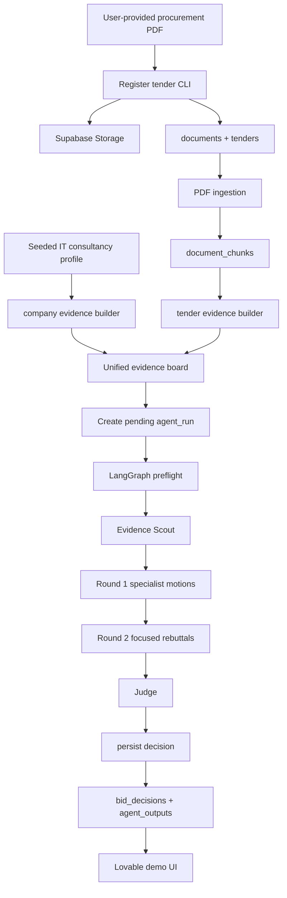

# Bidded

Bidded är en hackathon-scopad agentkärna för bid/no-bid-beslut i offentlig upphandling. Målet är att kunna mata in en textbaserad PDF för en svensk upphandling, jämföra kraven mot en seedad profil för ett större IT-konsultbolag, bygga en gemensam evidensyta och sedan låta flera specialiserade agenter argumentera fram ett spårbart beslut: `bid`, `no_bid`, `conditional_bid` eller `needs_human_review`.

Projektet är byggt kring en enkel princip: inga materiella påståenden utan evidens. Allt som agenterna hävdar ska kunna knytas till excerpt-nivå `evidence_items`. Det som saknar stöd ska markeras som antagande, saknad information, valideringsfel eller potentiell blockerare, inte smyga in som fakta.

## Nuvarande Status

Det här repot är i PRD- och storyfasen. Den första Python-scaffolden finns i root-repot, medan domänlogik, migrations och agentflöde byggs story för story.

| Del | Status |
| --- | --- |
| `ralph/prd.json` | Komplett PRD med 25 user stories för Bidded Swarm Core. Ralph-state styr vilken story som är nästa. |
| `ralph/state.json` | Pekar på aktuell Ralph-story och nästa action. |
| `plans/ralph-storie-plan.md` | Äldre plan/sammanfattning. Den behöver läsas som stödmaterial, inte som strikt source of truth. |
| `Makefile` | Kör Ralph-loop med Codex CLI via `make ralph`. |
| `.env.example` | Dokumenterar Claude, Supabase Storage och optional embedding-provider utan secrets. |
| Applikationskod | Grundpaket finns under `src/bidded` med subpackages för config, db, documents, evidence, agents, orchestration och cli. |
| Supabase-migrations | Core domain-, agent audit- och chunk/evidence-migrations finns. |
| Graph state | Typed `BidRunState` finns under `src/bidded/orchestration` med runtime control fields, audit artifacts, node ownership contracts och reducer-policy separerade. |
| Agent tool policies | Immutable policy contracts finns under `src/bidded/agents/tool_policy.py` för LLM-agenternas läs/skrivgränser och orchestratorns side effects. |
| Agent output schemas | Strict Pydantic schemas finns under `src/bidded/agents/schemas.py` för Round 1 motions, Round 2 rebuttals, Judge decisions och evidence-claim validation. |
| Seedat demo-bolag och demo-tender | `bidded seed-demo-company` upsertar en större syntetisk IT-konsultprofil, `bidded register-demo-tender` registrerar en lokal text-PDF, och `bidded.evidence` kan konvertera profilfakta till idempotenta `company_profile` evidence rows. |
| Pending agent runs | `bidded create-pending-run` validerar vald demo tender, demo company och tender document innan en `pending` `agent_runs`-rad med evidence-locked run config skapas. |
| Frontend | Ingen frontend i repot. Lovable är planerad som tunn demo-UI ovanpå Supabase i `US-025`. |

README:n beskriver därför både nuläget och den stack som PRD:n definierar att vi bygger mot. När stories implementeras ska planerade delar flyttas till faktiskt levererade delar.

## Vad Systemet Ska Göra

Bidded ska stödja ett konkret demo-flöde:

1. En operator registrerar en lokal, textbaserad PDF för en svensk offentlig upphandling.
2. PDF:en laddas upp till Supabase Storage och registreras som ett dokument.
3. Dokumentet parsas till sidrefererade chunks.
4. En seedad demo-profil för ett större IT-konsultbolag läggs in i databasen.
5. Tenderchunks och bolagsfakta omvandlas till excerpt-nivå evidence items.
6. En operator eller Lovable skapar en `pending` agent run.
7. Workern verifierar run context, dokumentstatus och evidence board innan graphen startar.
8. En Evidence Scout extraherar upphandlingens viktigaste fakta utan att ge bid/no-bid-råd.
9. Fyra specialistagenter gör oberoende Round 1-motions.
10. Samma agenter gör fokuserade Round 2-rebuttals.
11. En Judge-agent sammanfattar röster, blockerare, risker, saknad information och rekommenderade actions.
12. Slutbeslutet sparas i Supabase som ett auditerbart `bid_decision`, och run-status blir `succeeded`, `failed` eller `needs_human_review`.

Agentartefakter och UI-output ska vara engelska enligt PRD:n, men beslutskontexten är svensk offentlig upphandling.

## Stack

### Planerad Runtime-Stack

| Område | Teknik | Roll |
| --- | --- | --- |
| Språk | Python | Huvudruntime för agentkärna, CLI, ingestion, schemas och orchestration. |
| Agent-orchestration | LangGraph | Kör preflight, Evidence Scout, specialistmotions, rebuttals, Judge, persist decision och END i ett kontrollerat flöde. |
| LLM | Claude via Anthropic API | Producerar strukturerade agentoutputs. Miljövariabeln är `ANTHROPIC_API_KEY`. |
| Databas | Supabase Postgres | Source of truth för bolag, upphandlingar, dokument, chunks, evidens, agentkörningar och beslut. |
| Filstorage | Supabase Storage | Lagrar upphandlings-PDF:er och kopplar dem till dokumentrader. |
| Datamodell | SQL migrations + JSONB | Normaliserade tabeller där relationer är stabila, JSONB där agent- och domändata är mer flexibel. |
| Validering | Pydantic | Strikta schemas för graph state, agentroller, verdicts, evidence refs, blockerare, rebuttals och Judge-beslut. |
| PDF-processing | Text-PDF extraction | Endast textbaserade PDF:er är i scope. OCR och DOCX är uttryckligen non-goals för PRD:n. |
| Retrieval | Keyword/full-text fallback + optional embeddings | Demo ska fungera utan live embeddings men vara redo för embedding/pgvector senare. |
| Test | pytest | Deterministiska tester med mockad Claude, mockade embeddings och mockad Supabase där det behövs. |
| Lint | Ruff | Kvalitetsgrind för Python-koden. |
| UI | Lovable ovanpå Supabase | Planerad tunn demo-UI som skapar/läser runs men inte äger agentlogik. |

### Stack Som Finns I Repot Idag

| Område | Teknik | Status |
| --- | --- | --- |
| PRD/story-runner | Ralph | Aktivt. `ralph/prd.json`, `ralph/state.json`, `ralph/progress.md` och `ralph/ralph.sh` styr arbetet. |
| Lokal automation | Make | `make ralph` kör Ralph med Codex CLI. |
| LLM för implementation | Codex CLI | Makefile sätter `RALPH_CODEX_CMD="codex exec --model ..."` för Ralph-sessioner. |
| Miljö | `.env` via Makefile include | `.env.example` dokumenterar runtimevariabler utan secrets. |
| App-runtime | Python/LangGraph/Supabase | Python-scaffold, dependency-kontrakt och idempotent demo-company seed finns; övriga live integrations byggs i senare stories. |

## Arkitektur



Den viktigaste arkitekturregeln är att agenter inte ska resonera fritt från lösa promptar. De ska arbeta mot en gemensam evidence board, validerade schemas och en graph state där varje nod bara får skriva till sina egna fält.

## Datakontrakt

PRD:n definierar följande Supabase-tabeller:

| Tabell | Syfte |
| --- | --- |
| `companies` | Demo-bolaget, i första versionen ett större IT-konsultbolag med kapacitet, certifieringar, referenser och ekonomiska antaganden. |
| `tenders` | Upphandlingar som analyseras mot bolagsprofilen. |
| `documents` | Registrerade dokument med storage path, checksum, content type, roll, parse-status och koppling till tender/company. |
| `document_chunks` | Sidrefererade textchunks från PDF:er, med chunk index, metadata och nullable embedding/vector-placeholder. |
| `evidence_items` | Excerpt-nivå evidens från tenderdokument och company profile, med stabila human-readable evidence keys. |
| `agent_runs` | Livscykel för körningar: `pending`, `running`, `succeeded`, `failed`, `needs_human_review`, target tender/company, config och felmetadata. |
| `agent_outputs` | En immutable rad per agentroll, runda och outputtyp. Innehåller validerad JSON, modellmetadata, timing/cost-estimat och validation errors. |
| `bid_decisions` | Slutligt Judge-beslut kopplat till run med verdict, confidence, final JSON och `evidence_ids`. |

Migrations ska vara deterministiska och inte kräva Supabase Auth eller RLS för demo-tenant.

## Graph State Och Ägarskap

Bidded har en typed `BidRunState` innan nodlogiken fylls i. Den innehåller run-identitet, company/tender/document IDs, run context, chunks, evidence board, scout output, specialistmotions, rebuttals, validation errors, agent outputs, retry counts, final decision och status. `GraphNodeContract` dokumenterar varje nods read fields och owned write fields, och `apply_node_update` validerar mutationer mot append-only, write-once, runtime overwrite och role-keyed reducer-regler.

State-reglerna är explicita:

- runtime control fields som status, current step, retry counts, last error och working retrieval results får skrivas om
- validerade evidence board items, motions, rebuttals, validation errors, agent outputs och final decisions är append-only om inte en typad reducer uttryckligen merge:ar parallella outputs
- Round 1 och Round 2 använder reducers keyed by agent role så parallella specialistsvar inte skriver över varandra
- varje graph node ska dokumentera sina read fields och owned write fields

## Agentflöde

Graphens topology är fast:

1. preflight
2. Evidence Scout
3. parallella Round 1-specialister
4. Round 2-rebuttals
5. Judge
6. persist decision
7. END

Routing ska styras av orchestratorn, inte av LLM-valda handoffs. Saknade inputs, oparsade dokument, `parser_failed`, tom evidence board, invalid outputs efter retry exhaustion eller persistence failure ska leda till `failed`. En tekniskt valid run där kritisk saknad eller konfliktande evidens gör beslutet oförsvarbart ska kunna landa i `needs_human_review`.

### Evidence Scout

Evidence Scout kör först och ska inte ge bid/no-bid-rekommendationer. Den ska extrahera evidence-backed fakta från upphandlingen, framför allt:

- deadlines
- skall-krav
- kvalificeringskrav
- utvärderingskriterier
- kontraktsrisker
- obligatoriska inlämningsdokument

### Round 1: Specialistmotions

Efter Evidence Scout kör fyra roller oberoende och utan tillgång till varandras motioner:

| Roll | Fokus |
| --- | --- |
| Compliance Officer | Formella krav, hard blockers och compliance-risker. Endast denna roll får nominera formella compliance blockers som hard blocker-kandidater. |
| Win Strategist | Vinstchans, differentiering, kundfit och strategiska argument för eller emot bid. |
| Delivery/CFO Agent | Leveranskapacitet, kostnad, marginal, bemanning, risk och affärscase. |
| Red Team | Oberoende no-bid-orienterad kritik, svaga antaganden och negativa scenarier. |

Varje motion ska innehålla verdict, confidence, evidence-backed findings, role-specific risks/blockers, assumptions, missing information och recommended actions.

### Round 2: Fokuserade Rebuttals

Round 2 är första gången specialisterna får läsa andra agenters validerade motioner. De ska rikta in sig på:

- största oenigheterna
- unsupported claims
- blocker challenges
- materiellt saknad information
- Red Team-angrepp på starkaste bid-argumenten och conditional-bid-logik

### Judge

Judge producerar det slutliga beslutet. Formella compliance blockers ska automatiskt gate:a till `no_bid`. Om hard blockers saknas får Judge använda evidence-backed omdöme över specialiströstningen, men måste förklara varför den accepterar eller overridar majoriteten.

Judge-output ska innehålla:

- `verdict`
- `confidence`
- `vote_summary`
- disagreement summary
- `compliance_matrix`
- `compliance_blockers`
- `potential_blockers`
- `risk_register`
- `missing_info`
- `recommended_actions`
- `cited_memo`
- `evidence_ids`

## Agenternas Tool Policy

LLM-agenterna ska producera validerade artefakter, inte äga persistence eller side effects.

| Agent | Får läsa | Får skriva |
| --- | --- | --- |
| Evidence Scout | Bounded retrieval för aktuell `agent_run`, `tender_id` och `company_id` | Evidence-backed scout output och evidence candidates; inga direkta persistenta mutations |
| Specialistagenter | Shared evidence board och, i Round 2, validerade Round 1-motions | Egna motions, rebuttals, missing_info och potential_evidence_gaps |
| Judge | Validerad evidens, motions och rebuttals | Final decision artifact |
| Orchestrator | Hela run-kontraktet | Supabase writes, status transitions, validering och persistence av `evidence_items`, `agent_outputs` och `bid_decisions` |

I v1 har ingen LLM-agent arbitrary web search, filesystem access, code execution, direkt databasmutation eller rätt att introducera nya externa källor under en run.

## Evidence Policy

Bidded ska vara evidence-locked:

- Materiella påståenden kräver evidence IDs.
- Evidence items ska vara excerpt-nivå, inte hela dokument eller hela chunks.
- Tender-evidens ska kunna peka tillbaka till dokument, chunks och sidor.
- Company-evidens ska kunna peka tillbaka till seedad profilmetadata via `company_id`, `field_path` och source label.
- Saknat stöd ska inte tyst accepteras som fakta.
- Unsupported non-material points ska typas som `assumptions`, `missing_info` eller `potential_evidence_gaps`.
- Missing company evidence ska bli `missing_info`, `assumptions`, `recommended_actions` eller `potential_blockers`, inte automatiskt `no_bid`.

Detta är kärndifferentiatorn: systemet ska kunna visa varför ett beslut togs.

## CLI Och Worker

PRD:n beskriver en lokal CLI/worker. Den kan nu:

- seeda demo-bolaget idempotent
- registrera en lokal text-PDF som tenderdokument
- ladda upp PDF:en till Supabase Storage och spara dokumentrad med checksumma

Planerade kommande kommandon ska kunna:

- konvertera seedade bolagsfakta till `company_profile` evidence items
- extrahera och chunka text-PDF:er
- skapa en `pending` agent run utan att köra LLM eller dokumentprocessing
- köra en specificerad `agent_run` via ID eller plocka äldsta pending run för demo-bolaget
- uppdatera run-status till `running`, `succeeded`, `failed` eller `needs_human_review`
- skriva normaliserade `agent_outputs` och `bid_decisions`
- logga tillräckligt lokalt för demooperation medan Supabase förblir source of truth

Seed-kommandot kräver `SUPABASE_URL` och `SUPABASE_SERVICE_ROLE_KEY`:

```bash
.venv/bin/bidded seed-demo-company
```

Tenderregistrering kräver `SUPABASE_URL`, `SUPABASE_SERVICE_ROLE_KEY` och
`SUPABASE_STORAGE_BUCKET`. Den föredragna lokala demo-filen, när den finns, är
gitignored: `data/demo/incoming/Bilaga Skakrav.pdf`.

```bash
.venv/bin/bidded register-demo-tender \
  data/demo/incoming/Bilaga\ Skakrav.pdf \
  --title "Skakrav for IT consultancy" \
  --issuing-authority "Example Municipality" \
  --procurement-reference "REF-2026-001" \
  --metadata procedure=open
```

## Miljövariabler

### Finns Idag

| Variabel | Används av | Kommentar |
| --- | --- | --- |
| `ANTHROPIC_API_KEY` | Ralph/Claude CLI via Makefile | Finns i `.env.example`. Behövs för `make ralph`. |

### Planerade Enligt PRD

| Variabel | Används av | Kommentar |
| --- | --- | --- |
| `ANTHROPIC_API_KEY` | Python worker / Claude | LLM-körning för agentflödet. |
| `SUPABASE_URL` | Python worker | Hosted Supabase demo project. |
| `SUPABASE_SERVICE_ROLE_KEY` | Python worker | Server-side access för demo worker. Ska inte exponeras i frontend. |
| `SUPABASE_STORAGE_BUCKET` | PDF registration | Bucket för uppladdade upphandlingsdokument. |
| `EMBEDDING_PROVIDER` | Retrieval | Optional. Saknas den ska keyword/full-text fallback fortfarande fungera. |

## Utvecklingsflöde Idag

För att köra Ralph-loop lokalt:

```bash
cp .env.example .env
# fyll i ANTHROPIC_API_KEY i .env
make ralph
```

Makefile använder:

- `RALPH_CODEX_MODEL ?= gpt-5.4`
- `RALPH_SESSIONS ?= 10`
- `ralph/ralph.sh --tool codex`

För app-scaffolden finns de första deterministiska kvalitetsgrindarna:

```bash
python3 -m venv .venv
.venv/bin/python -m pip install -e ".[dev]"
.venv/bin/pytest -q
.venv/bin/ruff check .
```

Core domain-migrationen finns under `supabase/migrations/`. Agent audit-, chunk/evidence-, seed-kommandot, tenderregistreringen och company-evidence buildern finns; övriga worker-kommandon byggs i senare stories.

## Teststrategi

När appen byggs ska kvaliteten styras av:

- `pytest` för unit- och integrationstester
- `ruff check` för lint
- mockad Claude-output för deterministiska agenttester
- mockad/deterministisk embedding-adapter
- mockad Supabase där live backend inte behövs
- schema construction och serialization-tester för Pydanticmodeller
- state ownership-, append-only- och reducer-tester
- evidence-claim validation för missing evidence IDs, assumptions, missing_info och tender/company comparison claims
- graph routing- och retry/stop-tester för success, invalid output, missing inputs, empty evidence, `failed`, `needs_human_review` och END
- en mocked end-to-end-test som seeder bolag, registrerar fixture-data, bygger evidence board, kör alla swarm-rundor och sparar ett slutbeslut

Live Claude, live embeddings och live Supabase kan användas för demo-smoke, men ska inte vara krav för story-completion.

## Roadmap Från PRD

Roadmapen drivs av `ralph/prd.json`; Ralph-state pekar alltid på nästa ej klara story.

| ID | Story |
| --- | --- |
| US-001 | Scaffold Python agent core |
| US-002 | Add core Supabase schema |
| US-003 | Add agent audit schema |
| US-004 | Add chunk evidence schema |
| US-005 | Define graph state schema |
| US-006 | Enforce state ownership rules |
| US-007 | Define agent tool policies |
| US-008 | Define agent output schemas |
| US-009 | Validate evidence claims |
| US-010 | Seed demo company profile |
| US-011 | Convert company facts to evidence |
| US-012 | Register demo tender PDF |
| US-013 | Create pending run context |
| US-014 | Ingest PDF chunks |
| US-015 | Add retrieval fallback |
| US-016 | Build tender evidence board |
| US-017 | Add graph routing shell |
| US-018 | Implement Evidence Scout node |
| US-019 | Implement specialist motions |
| US-020 | Implement focused rebuttals |
| US-021 | Implement Judge decision |
| US-022 | Add worker lifecycle CLI |
| US-023 | Add retry stop policy |
| US-024 | Test mocked end-to-end run |
| US-025 | Prepare Lovable handoff |

## Out Of Scope För Nuvarande PRD

Följande är uttryckligen inte del av den här PRD:n:

- full Next.js/React-frontend
- Supabase Auth och RLS
- OCR
- DOCX-parsing
- automatisk tender search/import
- krav på live embedding-provider
- Lovable som agentruntime
- arbitrary web search, filesystem access, code execution eller direkt database mutation för LLM-agenter under en run
- lagring av fulla raw prompts som default audit artifact

Lovable ska vara en tunn demo-yta som kan skapa pending `agent_runs` och läsa resultat från Supabase. Python-workern äger den långkörande LangGraph/Claude-logiken.

## Projektprinciper

- Evidens först, agentåsikter sedan.
- Beslut ska kunna granskas i efterhand.
- Demo ska fungera deterministiskt utan live LLM i test.
- Retrieval ska ha fallback så demo inte faller på embeddings.
- Compliance hard blockers ska behandlas striktare än strategiska eller kommersiella risker.
- Missing information är ett förstaklassresultat, inte ett promptmisslyckande.
- Orchestratorn äger side effects; agenterna äger validerade argument.

## Öppna Frågor För Lovable-Integration

Det här är frågor som behöver stämmas av mot den Lovable-frontend som redan finns, så att Supabase-schema, worker och UI kopplas ihop utan glapp.

1. Skapar Lovable en `pending` `agent_run` direkt i Supabase, eller ska frontend anropa en kontrollerad RPC/Edge Function som exempelvis `create_pending_run`?
2. Har frontenden redan ett PDF-uploadflöde, eller är antagandet att PDF:er registreras via lokal CLI/worker innan Lovable skapar eller visar runs?
3. Vilka exakta fält läser Lovable idag för run-lista och run-detalj? Behöver vi skapa read-vyer som `lovable_run_summary`, `lovable_evidence_board`, `lovable_agent_outputs` och `lovable_decision_detail`?
4. Vilka statusar renderar UI:t idag? PRD:n använder `pending`, `running`, `succeeded`, `failed` och `needs_human_review`.
5. Förväntar sig UI:t ett enda samlat JSON-objekt för beslutet, eller separata rader från `agent_outputs`, `evidence_items` och `bid_decisions`?
6. Vilken JSON-shape behöver Lovable för att rendera Round 1-motions, Round 2-rebuttals och Judge-beslut? Exempel på viktiga fält är `verdict`, `confidence`, findings, evidence references, assumptions, missing info, recommended actions, risk register och compliance matrix.
7. Ska Lovable visa evidence citations som stabila `evidence_key`s, UUIDs från `evidence_items`, eller båda?
8. Ska UI:t kunna visa både `tender_document`-evidens och `company_profile`-evidens, inklusive dokument/page refs respektive company `field_path`?
9. Hur ska frontend hantera `failed` och `needs_human_review`? Behövs särskilda felmeddelanden, retry-knappar eller bara läsbar status?
10. Hur hanteras demo-säkerhet i Supabase? PRD:n säger ingen Auth/RLS i v1, men om Lovable pratar direkt med Supabase från browsern behöver vi bestämma om det är öppen demo-åtkomst, read-only anon + RPC, eller en server-side wrapper.
11. Ska Lovable kunna skapa en helt ny demo-run från fixture-data utan live agent execution, så att frontenden alltid kan visas även om Claude/Supabase-worker inte kör?
12. Finns det redan komponenter eller naming conventions i Lovable-frontenden som bör styra våra tabellnamn, view-namn eller JSON-fältnamn?
